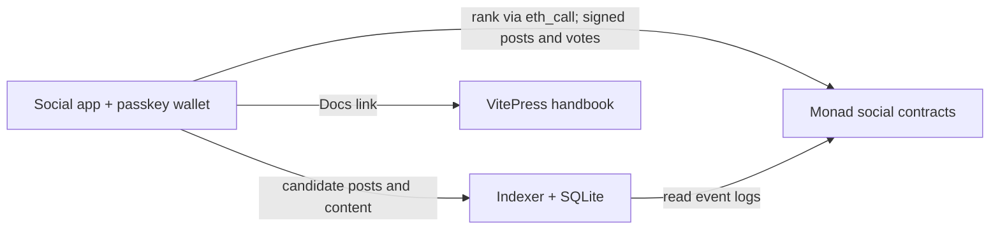

# Mochi Network

**Your feed. Your algorithm.** A social network on Monad where people can read,
switch, or publish the smart contract that ranks their feed.

Posts, replies, votes, karma, handles, and community membership are recorded on
chain. The browser asks an indexer for candidate posts, then calls a ranking
contract with `eth_call`. Reading and switching a feed needs no transaction;
posting and voting use a passkey wallet and testnet MON.

## What to try

1. Open Home or Popular and switch between Hot, Best, New, and Controversial.
2. Inspect an algorithm's Solidity source in the feed picker.
3. Create a passkey account, claim a handle, and fund its address with testnet MON.
4. Join a community, post, reply, and vote. Karma changes the weight of votes.
5. Deploy an implementation of `IFeedAlgorithm` and try its address in the picker.

The indexer controls which candidates are returned; the selected contract controls
their ranking. Content and votes are public. Passkeys require HTTPS or localhost
and an authenticator that supports WebAuthn PRF.

## Repository

| Directory | Purpose |
| --- | --- |
| [`web/`](web/) | Next.js social app and browser wallet |
| [`web/docs/`](web/docs/) | VitePress handbook: user guide, algorithms, API, deployment |
| [`contracts/`](contracts/) | Social registries, feed algorithms, deployment scripts, Foundry tests |
| [`indexer/`](indexer/) | Chain event ingestion, SQLite cache, HTTP API, optional image uploads and push |

The complete smart contract source, ABIs, deployment scripts, and tests are in
`contracts/`. Developing or deploying Mochi does not require a separate contracts
repository. The only Git submodule is Foundry's public `forge-std` test library.



## Run locally

Requirements: **Node.js 24**, **pnpm 10**, and **Foundry** (`forge`, `anvil`).

```bash
git clone --recurse-submodules https://github.com/sonninjaverse/mochinetwork.git
cd mochinetwork
npm --prefix indexer ci
pnpm --dir web install --frozen-lockfile
```

Start the indexer in one terminal:

```bash
cd indexer
cp .env.example .env
npm run dev
```

The template uses the published Monad testnet contracts listed in
[`contracts/DEPLOYED.md`](contracts/DEPLOYED.md). Initial backfill completes before
the API starts listening. A dedicated RPC endpoint makes the historical sync much
faster; set `MONAD_RPC_HTTP` and a suitable `LOG_CHUNK_SIZE`. Keep `mochi.db` between
runs. To use a new deployment, update both indexer and web contract addresses and
the indexer's deployment blocks.

Start the social app in another terminal:

```bash
cd web
cp .env.example .env.local
pnpm dev
```

Open **http://localhost:3000**. The indexer listens at **http://localhost:8787**.
Without an indexer, the interface renders but cannot load indexed posts.

Run the handbook separately:

```bash
pnpm --dir web docs:dev --port 5174
```

Open **http://localhost:5174**, or use the app's **Docs** link.

## Checks and a disposable demo

```bash
(cd contracts && forge test)
(cd indexer && npx tsc --noEmit && npm test)
(cd web && pnpm test && pnpm build && pnpm docs:build)
```

The browser suite starts Anvil, deploys the social contracts, seeds sample
communities and posts, runs the real indexer, and builds the social app. It does
not require testnet funds or API keys:

```bash
pnpm --dir web exec playwright install chromium
pnpm --dir web test:e2e
```

Keep local `.env.local` overrides out of the browser-test build. Testnet and local
Anvil accounts are separate; the suite's burner wallet is for disposable funds.

## Deployment

The app and handbook can run on hosts of your choice. Configure
`NEXT_PUBLIC_APP_URL`, `NEXT_PUBLIC_DOCS_URL`, and `NEXT_PUBLIC_INDEXER_URL` before
building the app. Set `WEB_ORIGINS` on the indexer and `DOCS_APP_URL` when building
the handbook. There are no automatic production deployment workflows.

Passkeys are scoped to a relying party. `NEXT_PUBLIC_RP_ID` defaults to the current
hostname; set a stable parent host when sharing accounts across subdomains.
Keep the relying party unchanged for existing accounts.

See the [deployment guide](web/docs/reference/deploy.md),
[API reference](web/docs/reference/indexer-api.md), and
[algorithm guide](web/docs/algorithms/writing.md). Optional Pinata credentials,
VAPID private keys, gate secrets, and deployment keys belong in local/server
environment files, never in `NEXT_PUBLIC_*` variables.

## License

[MIT](LICENSE). Bundled fonts retain their own licenses.
